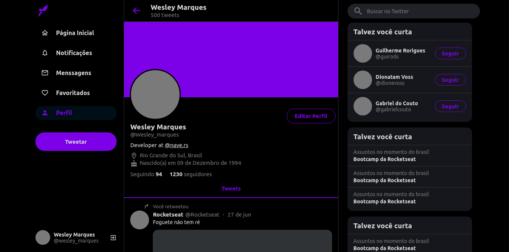

<p align="center">
  

  
  
  <a href="https://github.com/WesleyMarquesGit/TwitterClone/commits/master">
    
  </a>

  
   <a href="https://github.com/WesleyMarquesGit/TwitterClone/stargazers">
    
  </a>
</p>

---

### :rocket: Sobre o projeto

Este projeto foi basicamente uma copia da interface do Twitter, e foi utilizado para estudo sobre responsividade.

---

### 🎨 Interface

<h1 align="center">
  
</h1>

- [Acessar link Netlify][twitterclone]

### :space_invader: Tecnologias

As seguintes ferramentas foram usadas na construção do projeto:

- [Node.js][nodejs]
- [React][reactjs]
- [Styled-components][styledcomponents]

---

### :computer: Manual

#### Pré-requisitos

- É **necessário** possuir o **[Node.js][nodejs]** instalado no computador
- É **necessário** possuir o **[Git][git]** instalado e configurado no computador
- Também, é **preciso** ter um gerenciador de pacotes seja o **[NPM][npm]** ou **[Yarn][yarn]**.

#### Como executar

#### 1. Clone o repositório

```bash
# Clone este repositório
$ git clone https://github.com/WesleyMarquesGit/TwitterClone.git
```

#### 2. Rodando a aplicação web (Front-End)

```bash
# Acesse a pasta do projeto no seu terminal/cmd
$ cd TwitterClone

# Instale as dependências
$ yarn

# Execute a aplicação em modo de desenvolvimento
$ npm start

# A aplicação será aberta na porta:3000 - acesse http://localhost:3000

├── /src
|   ├── /components
|   ├── /styles

```

---

### :recycle: Como contribuir para o projeto

1. Faça um **fork** do projeto.
2. Crie uma nova branch com as suas alterações: `git checkout -b sua-feature`
3. Salve as alterações e crie uma mensagem de commit contando o que você fez: `git commit -m "feat/nova-feature"`
4. Envie as suas alterações: `git push origin sua-feature`

---

### :page_with_curl: Licença

Este projeto esta sobe a licença MIT.

---

[yarn]: https://yarnpkg.com/
[npm]: https://www.npmjs.com/
[nodejs]: https://nodejs.org/
[koajs]: https://koajs.com/
[knex]: http://knexjs.org/#Installation-node
[reactjs]: https://reactjs.org
[styledcomponents]: https://styled-components.com/docs/basics
[git]: https://git-scm.com/
[postgres]: https://www.postgresql.org/
[license]: https://opensource.org/licenses/MIT
[twitterclone]: https://wes-twitter-clone.netlify.app/
